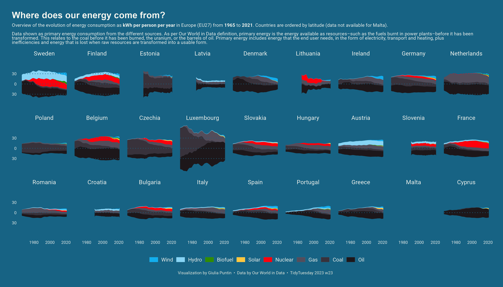
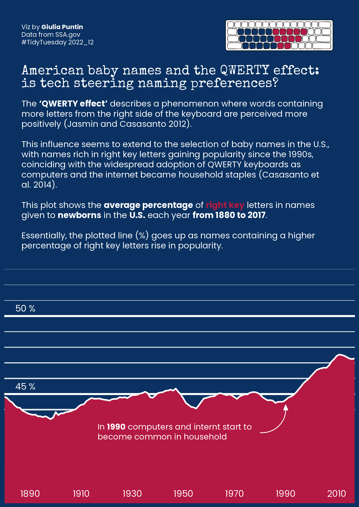

# TidyTuesday
My contributions to `#TidyTuesday`.

[TidyTuesday](https://github.com/rfordatascience/tidytuesday) is a weekly social data project organized by the R4DS Online Learning Community. It aims at making data learning easier through the use of real-world datasets to practice data tidying and visualization.   
`#RStats` `#Tidyverse` `#ggplot`

I take this as an opportunity to play around with different types of data and plots, and practice with a new 📦package every time. 

- 2024_11 🎓 Fiscal Sponsors in Education. 📦{waffle}

- 2023_23 ⚡ Evolution of per capita energy consumption in Europe. 📦{ggstream}
  

- 2022_12 👶 The "QWERTY effect" on American baby names. 📦{ggtext}

  

- 2018_36 🍃 Invasive species in Africa. 📦{patchwork} (🥉 RBZS Data Viz challenge 2021)

- 2021_42 🎣 Global fisheries. 📦{gganimate}

